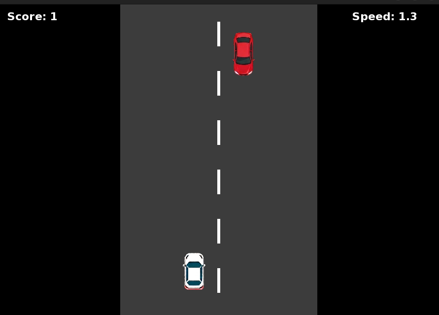
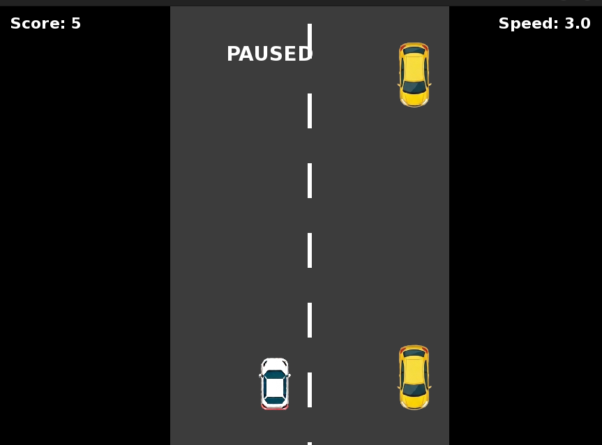
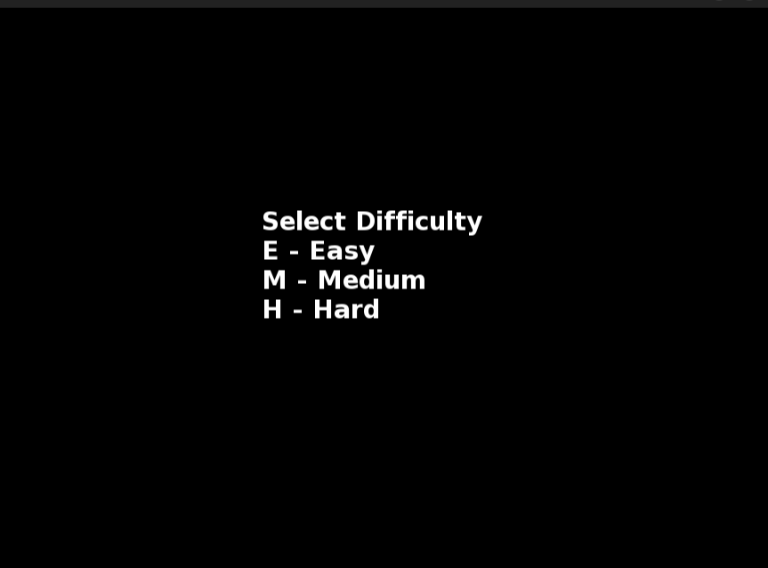
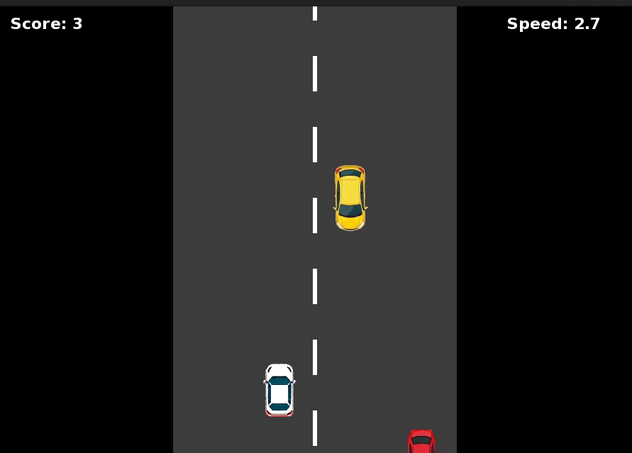

# 🚗 Car Dodging Game (C++ + SFML)

A simple and fun **Car Dodging Game** developed using **C++** and **SFML**.  
The player controls a white car and must dodge incoming enemy cars while the game speed gradually increases over time.

✅ Developed and tested on **Ubuntu Linux** using SFML.

---

# 📌 Features

- 🎮 Smooth player movement
- 🚗 Multiple enemy cars
- ⚡ Increasing game difficulty
- 🔊 Crash sound effects
- ⏸ Pause functionality
- 🔁 Restart system
- 🏆 Score tracking
- 🎯 Difficulty selection
- 🛣 Animated moving road
- 🎨 SFML graphics and textures

---

# 📸 Game Preview

## 🎬 Starting Screen


---

## ⏸ Paused Screen


---

## 🎮 Gameplay


---

## 💥 Game Over / Accident Screen


---

## 🔁 Restart Screen


---

# 🖥 Technologies Used

- **C++**
- **SFML**
  - Graphics
  - Audio
  - Window Management
  - Event Handling

---

# 📂 Project Structure

```text
Car Dodging Game/
│
├── Assets/
│   ├── WhiteCar.png
│   ├── RedCar1.png
│   ├── RedCar2.png
│   ├── YellowCar1.png
│   ├── YellowCar2.png
│   ├── YellowCar3.png
│   ├── crash.wav
│   └── DejaVuSans-Bold.ttf
│
├── Starting.png
├── Start.png
├── Paused.png
├── Restart.png
├── When Accident It Restart.png
│
├── main.cpp
├── highscore.txt
└── README.md
```

---

# 🎮 Controls

| Key | Action |
|------|---------|
| ⬅ Left Arrow | Move Left |
| ➡ Right Arrow | Move Right |
| P | Pause Game |
| R | Restart Game |
| E | Easy Mode |
| M | Medium Mode |
| H | Hard Mode |

---

# 🎯 Difficulty Modes

## 🟢 Easy
- Lower speed
- Slow enemy spawning
- Beginner friendly gameplay

---

## 🟡 Medium
- Moderate speed
- Balanced gameplay experience

---

## 🔴 Hard
- High speed
- Very fast enemy spawning
- Challenging gameplay

---

# 🧠 Game Logic

The game includes:

- Random enemy spawning
- Lane-based movement
- Collision detection
- Dynamic speed increase
- Score tracking system
- Pause and restart system
- Smooth movement using delta time

---

# 🔊 Audio Features

The game uses the SFML Audio module for:
- Crash sound effects
- Gameplay sound handling

---

# ⚙ Requirements

Before running the project, install:

- Ubuntu Linux
- g++
- SFML 2.5 or above

---

# 🖥 Running the Game on Ubuntu

## 🔹 Step 1: Install SFML

Open terminal and run:

```bash
sudo apt update
sudo apt install libsfml-dev
```

---

## 🔹 Step 2: Clone Repository

```bash
git clone https://github.com/Ayushman-Sahoo/Car-Dodging-Game.git
```

---

## 🔹 Step 3: Go Inside Project Folder

```bash
cd "Car Dodging Game"
```

---

## 🔹 Step 4: Compile the Game

```bash
g++ main.cpp -o game \
-lsfml-graphics \
-lsfml-window \
-lsfml-system \
-lsfml-audio
```

---

## 🔹 Step 5: Run the Game

```bash
./game
```

---

# ❗ Important Note

Make sure the `Assets` folder remains inside the project directory.  
Otherwise textures, fonts, and sounds will not load properly.

---

# 🚀 Future Improvements

Possible future updates:

- 🌌 Better background animations
- 🎵 Background music
- 🚗 More enemy vehicle types
- 🏆 Improved leaderboard system
- 📱 Mobile version
- 🎮 Multiplayer support
- ✨ Better visual effects

---

# 🐛 Known Issues

- Requires proper SFML installation
- Fixed game window size
- Audio may not work if SFML Audio is missing

---

# 👨‍💻 Author

## Ayushman Sahoo

GitHub:  
https://github.com/Ayushman-Sahoo

---

# ⭐ Support

If you liked this project:

- ⭐ Star the repository
- 🍴 Fork the project
- 🚀 Share it with others

---

# 📜 Disclaimer

This project was developed and tested on **Ubuntu Linux** using SFML.

If you make any improvements or modifications, please first test them properly on your own system before sharing or updating the project.

For any issues or suggestions, feel free to contact:

📧 Email: ayushmansahoo648@gmail.com
